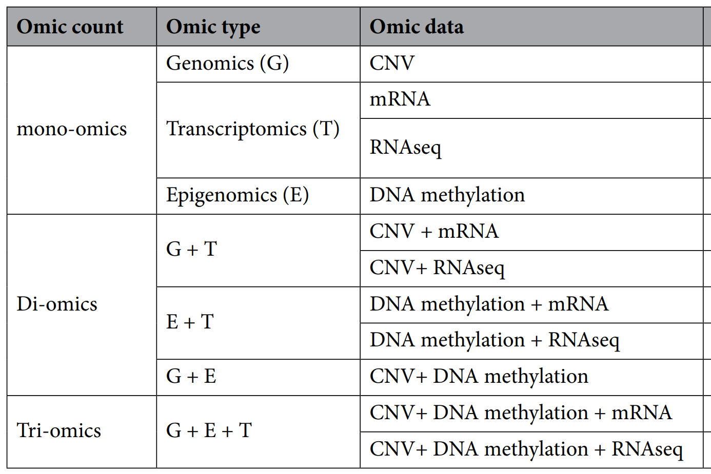

# Omics dataset

## Download dataset
The jupyter notebook `omics_data_preparation.ipynb` provides way to download the four types omics data and proprocess procedure. 

A simple to use it: change the domain of the notebook from 'github.com' to 'githubtocolab.com'. And it will open in Google Colab automatically.

We also provide the preprocessed data, which can be downloaded directly from the [Google Drive Link](https://drive.google.com/drive/folders/1-I54hMQOTHLTsKpf26pe_yDyIp-2HoB5?usp=sharing). Put the code below into a .sh file and run it from terminal. The example will download the `cnv.csv`. You need to change the `FILEID` and `FILENAME` to download different dataset.

```bash
# download any file from the google drive using wget
# Assume the file link is https://drive.google.com/file/d/1-1CllImqDG29XvU9raJfRHR4Hd77WX_W/view?usp=sharing

FILEID=1-1CllImqDG29XvU9raJfRHR4Hd77WX_W
FILENAME='cnv.csv'
wget --load-cookies /tmp/cookies.txt "https://docs.google.com/uc?export=download&confirm=$(wget --quiet --save-cookies /tmp/cookies.txt --keep-session-cookies --no-check-certificate 'https://docs.google.com/uc?export=download&id=$FILEID' -O- | sed -rn 's/.*confirm=([0-9A-Za-z_]+).*/\1\n/p')&id=$FILEID" -O $FILENAME && rm -rf /tmp/cookies.txt
```

## Dataset details

The folder contains four types of data: CNV, mRNA, DNA methylation, RNAseq. All data are downloaded from the TCGA Ovarian Cancer (OV) cohort hosted in [UCSC Xena data portal](https://xenabrowser.net/datapages/). All size are specified in the format (num_features, num_patients)

* [CNV](https://xenabrowser.net/datapages/?dataset=TCGA.OV.sampleMap%2FGistic2_CopyNumber_Gistic2_all_data_by_genes&host=https%3A%2F%2Ftcga.xenahubs.net&removeHub=https%3A%2F%2Fxena.treehouse.gi.ucsc.edu%3A443): copy number variation (gene-level). Size: (24776, 579).
    * Copy number profile was measured experimentally using whole genome microarry. Subsequently, TCGA FIREHOSE pipeline applied GISTIC2 method to produce segmented CNV data, which was then mapped to genes to produce gene-level estimates. 

* [mRNA](https://xenabrowser.net/datapages/?dataset=TCGA.OV.sampleMap%2FHT_HG-U133A&host=https%3A%2F%2Ftcga.xenahubs.net&removeHub=https%3A%2F%2Fxena.treehouse.gi.ucsc.edu%3A443). Size: (12042, 593)
    * The gene expression profile was measured experimentally using the Affymetrix HT Human Genome U133a mircoarrayu platform. This dataset shows the gene-level transcription estimates. Data is in log space. Each gene or exon has been centered to zero by default. 

* [RNAseq](https://xenabrowser.net/datapages/?dataset=TCGA.OV.sampleMap%2FHiSeqV2_exon&host=https%3A%2F%2Ftcga.xenahubs.net&removeHub=https%3A%2F%2Fxena.treehouse.gi.ucsc.edu%3A443): exon espression RNAseq. Size: (20530, 308)
    * The exon expression profile was measured experimentally using the Illumina HiSeq 2000 RNA Sequencing platform. This dataset shows the exon-level transcription estimates, as in RPKM values (Reads Per Kilobase of exon model per Million mapped reads). Each gene or exon has been centered to zero by default. 

* [DNA methylation](https://xenabrowser.net/datapages/?dataset=TCGA.OV.sampleMap%2FHumanMethylation27&host=https%3A%2F%2Ftcga.xenahubs.net&removeHub=https%3A%2F%2Fxena.treehouse.gi.ucsc.edu%3A443). Size: (27578, 616)
    * DNA methylation profile was measured experimentally using the Illumina Infinium HumanMethylation27 platform. DNA methylation beta values are continuous variable between 0 and 1, representing the ratio of the intensity of the methylated bead type to the combined locus intensity. Higher beta values represent higher level of DNA methylation. 

## Dataset Preprocess details
The data preprocess follows the steps same as [Hira et al.](https://www.nature.com/articles/s41598-021-85285-4.pdf)

<figure>
    
    <figcaption>Summary of data combinations included in the dataset folders</figcaption>
</figure>   

<figure>
    
    <figcaption>Data preprocessing with di- and tri-omics data generation. The figure is taken from Hira's paper. Thus the feature number and sample number might be different.</figcaption>
</figure>   

